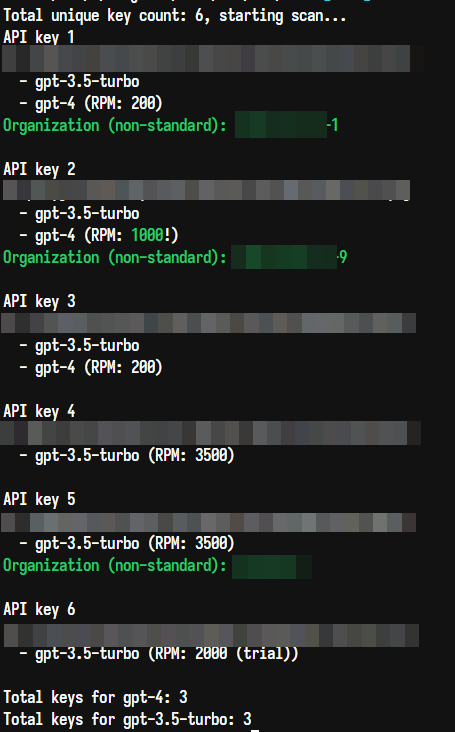

## KuteKeyChecker

- Install Nim
- `cd` to the repo's root directory
- `nim c -d:release -o:checker.exe src/main.nim`
- Add all keys to the `keys.txt` in the folder where you'll run the binary from.
- The results will be available both in the console log and in the `scan_results` folder.
- If you retry the scan, the current `scan_results` will be copied to `scan_results_old` for safety.

I don't provide any support, feel free to open issues and feature requests but don't expect any replies.

### Features
- Cross-platform
- No dependencies outside of the Nim standard library and OpenSSL (bundled with the Nim install on Windows, widely available on *nix)
- Asynchronous - multiple key checks are done at the same time
- Ratelimits - allows to see if a key is a trial one, or has higher than default ratelimits, which usually means better quota
- Organization names - will show you the key's organization owner if it's not the default "user-asdasd" stuff, which can also hint at better quota

### Example output

In the terminal:


In the output files (gpt4.txt, gpt4_32k.txt, turbo.txt):
```
sk-first
sk-second (org: aicg-inc-1)
sk-third (org: anyan-corp, RPM: 1000)
sk-fourth (trial, org: locust-ai)
```

